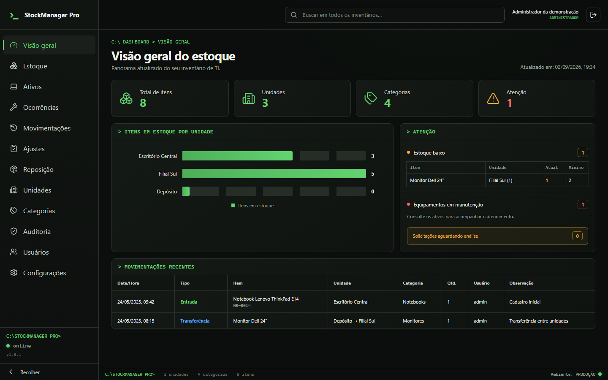
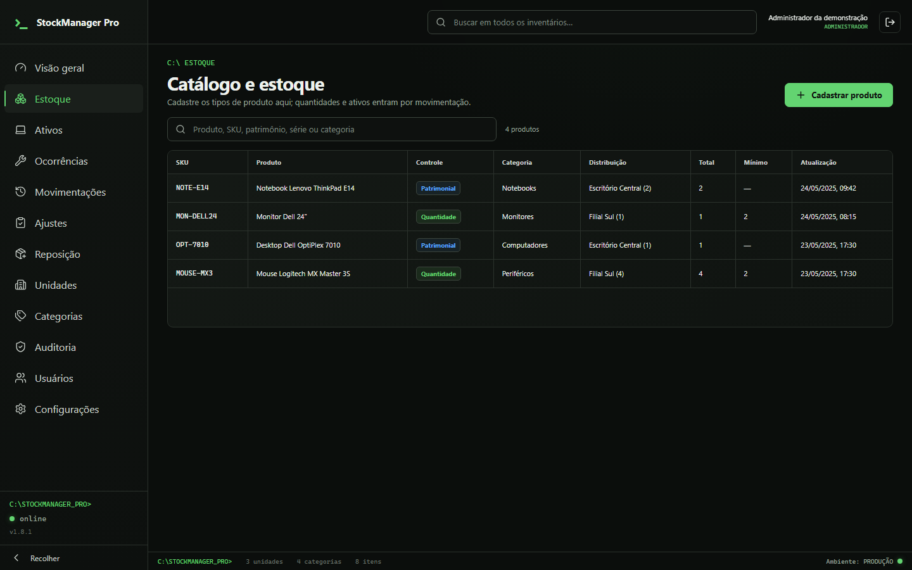
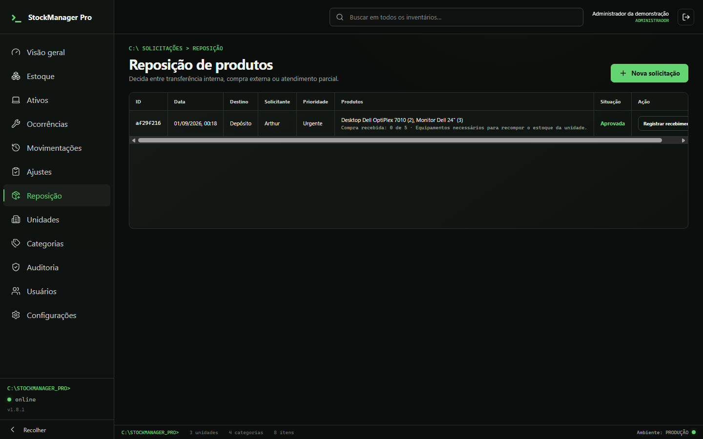
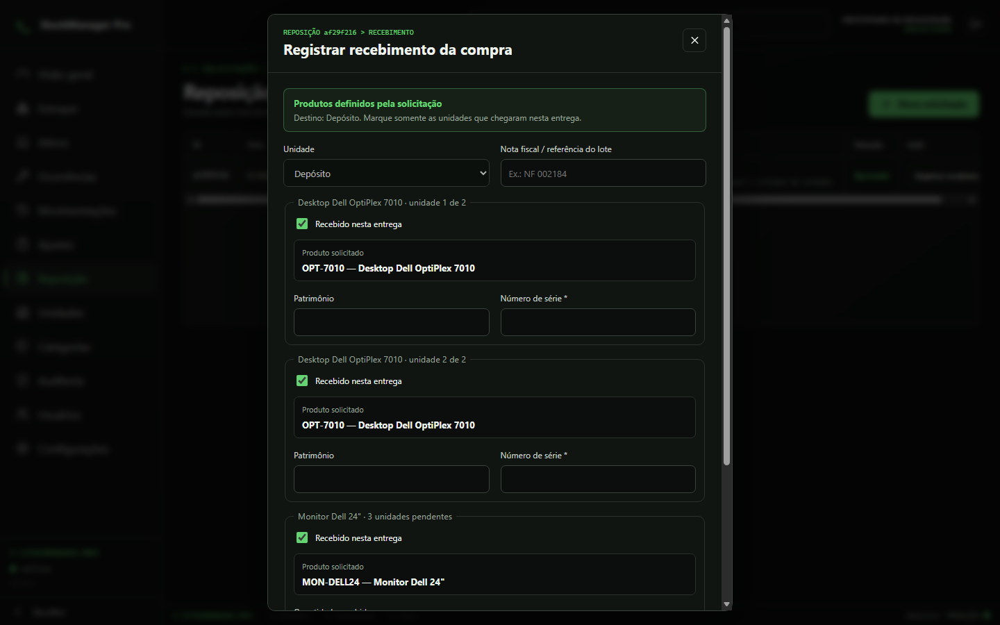
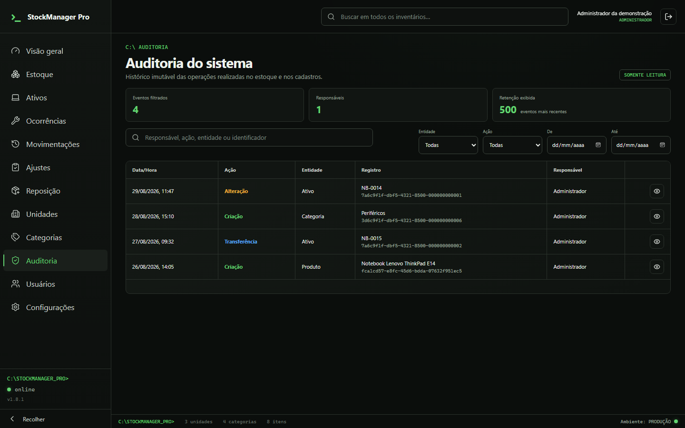

<p align="center">
  
</p>

<h1 align="center">StockManager Pro</h1>

<p align="center">
  Gestão local e auditável de estoques e ativos patrimoniais, com controle de acesso por função.
</p>

<p align="center">
  
  
  
  
  
</p>



## Sobre o projeto

O StockManager Pro é um aplicativo desktop para Windows que controla produtos por quantidade e equipamentos individualizados por patrimônio e número de série. A interface React/TypeScript conversa somente com o núcleo Tauri/Rust, onde ficam autenticação, autorização, regras de negócio, transações, auditoria e acesso ao banco SQLite local criptografado.

O projeto está em desenvolvimento ativo. A versão 1.8.1 é adequada para demonstração técnica e homologação controlada; distribuição institucional ainda depende dos itens indicados em [Estado do projeto](docs/PROJECT_STATUS.md), especialmente assinatura Authenticode e endurecimento operacional.

## Capacidades atuais

- Estoque híbrido: produtos quantitativos e ativos serializados.
- Entradas, saídas, transferências e ajustes em lote, com transação integral.
- Reposição com vários itens, aprovação gerencial e recebimento vinculado ao pedido.
- Recebimento parcial e rastreabilidade por lote, patrimônio e número de série.
- Ocorrências de ativos para defeito, manutenção, assistência, garantia e baixa.
- Autenticação local, sessões, bloqueio por tentativas e troca obrigatória de senha inicial.
- Permissões por perfil e por unidade, validadas novamente no backend.
- Auditoria com solicitante, revisor, decisão e estado anterior/posterior.
- Backup, restauração validada e importação de XLSX, ODS e CSV com prévia.
- Instalador NSIS para Windows sem janela de terminal auxiliar.

## Perfis de acesso

| Perfil | Responsabilidade principal |
|---|---|
| Operador | Consulta e movimenta a rotina das unidades vinculadas; relata ocorrências e solicita ajustes/reposição. |
| Gestor | Mantém o catálogo, executa operações em lote e analisa solicitações dentro das unidades sob sua gestão. |
| Administrador | Administra usuários, unidades, segurança, recuperação e operações técnicas globais auditadas. |

As regras completas estão em [Regras de negócio](docs/BUSINESS_RULES.md).

## Arquitetura

```text
React + TypeScript
        │ contratos tipados
        ▼
Tauri IPC
        │ comandos mínimos
        ▼
Rust — autenticação, autorização, regras e transações
        │ SQL parametrizado + migrações
        ▼
SQLite/SQLCipher — dados locais, histórico e auditoria
```

A separação segue SOLID: componentes dependem de contratos do domínio; gateways isolam infraestrutura; e o núcleo Rust é a autoridade para integridade e permissões. Consulte [Arquitetura](docs/ARCHITECTURE.md) e [Modelo de dados](docs/DATA_MODEL.md).

## Galeria

| Estoque | Solicitações de reposição |
|---|---|
|  |  |

| Recebimento vinculado | Auditoria |
|---|---|
|  |  |

## Executar localmente

Pré-requisitos: Windows 10/11, Node.js 24, pnpm 11, Rust stable com MSVC, Microsoft C++ Build Tools e WebView2.

```powershell
cd apps\desktop
pnpm.cmd install
pnpm.cmd tauri dev
```

Para validar a interface no navegador com dados demonstrativos:

```powershell
cd apps\desktop
pnpm.cmd dev
```

## Qualidade e build

```powershell
cd apps\desktop
pnpm.cmd check
cargo test --manifest-path src-tauri\Cargo.toml
pnpm.cmd desktop:build
```

O instalador NSIS é criado em `apps/desktop/src-tauri/target/release/bundle/nsis`. Artefatos compilados, bancos e relatórios locais não são versionados.

## Estrutura do repositório

```text
.
├── apps/desktop/       aplicativo Tauri, interface e núcleo Rust
├── docs/               arquitetura, regras, segurança e guia do código
├── legacy/             protótipo original preservado para referência
├── .github/            integração contínua e modelos de colaboração
├── CHANGELOG.md        histórico funcional das versões
└── SECURITY.md         política de reporte de vulnerabilidades
```

## Documentação

- [Guia do código](docs/GUIA_DO_CODIGO.md)
- [Desenvolvimento](docs/DEVELOPMENT.md)
- [Design system](docs/DESIGN_SYSTEM.md)
- [Revisão de segurança 1.8.1](docs/security/SECURITY_REVIEW_1.8.1.md)
- [Estado e próximos passos](docs/PROJECT_STATUS.md)

## Protótipo legado

A versão inicial em HTML, Python e planilhas continua disponível em [`legacy/`](legacy/README.md) apenas como registro histórico. Ela não representa a arquitetura, a segurança nem o fluxo recomendado do produto atual.

## Licença

Distribuído sob a licença MIT. Consulte [LICENSE](LICENSE).
